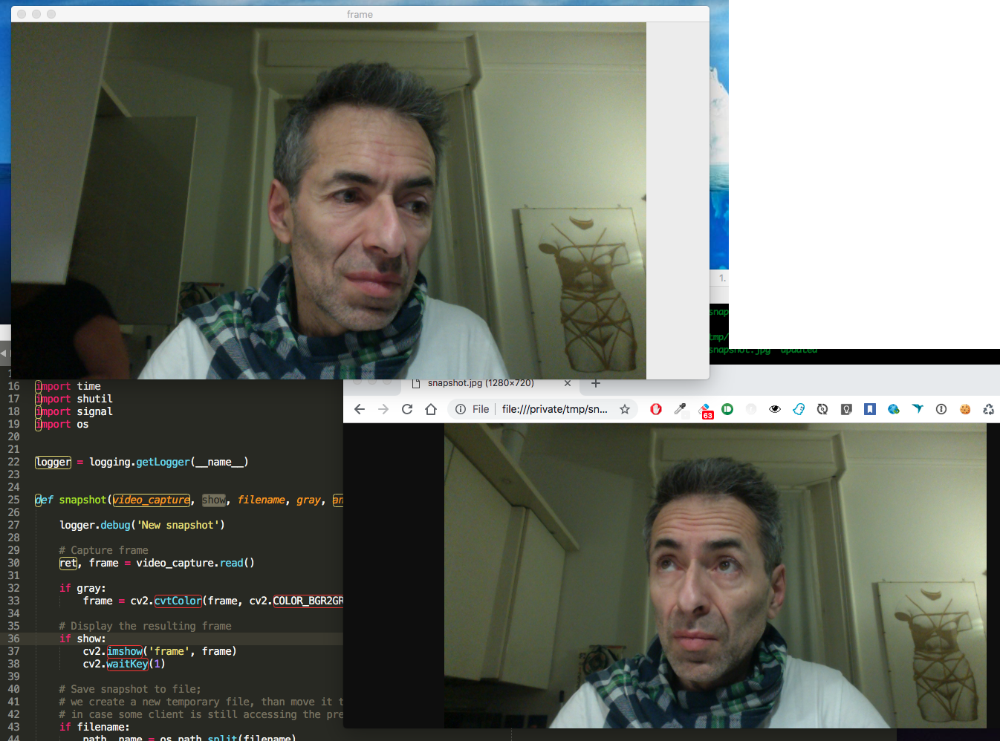

snapshot
========

Fun with `OpenCV`

```
usage: snapshot.py [-h] [--verbosity VERBOSITY] [--hide] [--gray] [--annotate]
                   [--filename FILENAME] [--polling_time POLLING_TIME]

Grab snapshot from video camera, and optionally save if to file

optional arguments:

  -h, --help            show this help message and exit
  --verbosity VERBOSITY, -v VERBOSITY
                        Verbosity level; 0=minimal output, 1=normal output,
                        2=verbose output, 3=very verbose output
  --hide                Do not show snapshot in a popup window
  --gray                Convert to gray
  --annotate            Annotate snapshot with timestamp
  --filename FILENAME, -f FILENAME
                        Optional filename for saving snapshot to disk
  --polling_time POLLING_TIME, -t POLLING_TIME
                        Polling time in [ms]; defaults to 1000
```


